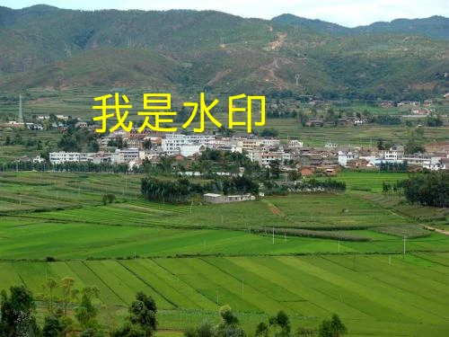

# image-test-tools

测试工程师，必备图片测试工具

recommend: [China-Gitee](https://gitee.com/liyinchi/image-test-tools)，[Other-Github](https://github.com/Musule/image-test-tools)

# 一、优点

* 简单易上手
* 开源免费
* 详细使用文档
* 提高测试效率

# 二、功能
* 批量重命名图片
* 批量下载图片
* 修改图片大小
* 生成不同格式图片
* 图片打水印


# 四、环境

### 1.nodejs

如果你电脑还未安装配置nodejs环境，请参考：https://www.runoob.com/nodejs/nodejs-install-setup.html

下载Nodejs

（建议版本使用v12.13.0 小于v15.0）

>https://npm.taobao.org/mirrors/node/v12.13.0/

>如果已安装配置nodejs，可跳过此步骤

### 2.安装

```bash
npm install
```


# 五、使用

## 1.批量重命名图片

#### （1）被重名的图片，放在image文件夹中

>image-test-tools/Rename/image


#### （2）命令行输入

#### ① 使用默认
```shell
node Rename/rename
```
* 如下图所示


#### ② 使用指定文件名和格式
```bash
node Rename/rename -n 图片 -p image -f jpg
```

* 如下图所示


重命名成功后，图片所存放的位置

>image-test-tools/Rename/image

#### （3）获取参数说明

命令行输入
```bash
node Rename/rename -h
```
* 如下图所示


|名称|是否必填|类型|描述|默认值|
|--|--|--|--|--|
|-n|可选|String|批量命名图片的名称|图片|
|-f|可选|String|批量命名图片的格式|jpg|
|-p|可选|String|批量命名图片的错放位置|image文件夹中|


## 2.批量下载图片

#### （1）把要下载的图片链接地址、命名名称，写入index.html文件中

>image-test-tools/ImageDownload/index.html

* 如下图所示


#### （2）命令行输入

```bash
node ImageDownload/download
```
* 如下图所示


下载成功后，图片所存放的位置

>image-test-tools/ImageDownload/image

* 如下图所示


#### （3）获取参数说明

命令行输入
```bash
node ImageDownload/download -h
```
* 如下图所示


|名称|是否必填|类型|描述|默认值|
|--|--|--|--|--|
|-p|可选|String|下载后图片文件存放位置|image文件夹中|


### 3.修改图片大小

#### （1）命令行输入
```bash
node Resize/resize -i "Resize/image/resize.jpg" -w 1000 -e 2000
```


修改成功后，图片所存放的位置

>image-test-tools/Resize/output


#### （2）被修改的图片，放在image文件夹中，你也可以替换成自己的图片

>image-test-tools/Resize/image

* 如下图所示


#### （3）获取参数说明

命令行输入
```bash
node Resize/resize -h
```
* 如下图所示


|名称|是否必填|类型|描述|默认值|
|--|--|--|--|--|
|-i|可选|String|被修改后，图片位置|"Resize/image/resize.jpg"|
|-w|可选|int|被修改后，图片的宽度|200|
|-e|可选|int|被修改后，图片的高度|200|
|-o|可选|String|被修改后，图片保存位置|"Resize/output/resize.jpg"|


## 4.生成不同格式图片

图片格式：jpg、jpeg、png、bmp、gif、webp、tiff、svg等

#### （1）命令行输入

指定格式，大小默认

```bash
node Made/made -f png
```

* 如下图所示


指定格式+图片大小

```bash
node Made/made -f webp -w 100 -e 200
```

* 如下图所示


#### （3）获取参数说明

命令行输入
```bash
node Made/made -h
```
* 如下图所示


|名称|是否必填|类型|描述|默认值|
|--|--|--|--|--|
|-f|可选|String|生成图片，指定格式|webp|
|-w|可选|int|指定图片宽度|200|
|-e|可选|int|指定图片高度|200|
|-i|可选|String|生成指定格式原始图片，存放位置|Made/image/format.jpg|
|-o|可选|String|生成的图片存放位置|Made/output/format|


生成成功后，图片所存放的位置

>image-test-tools/Made/output


## 5.图片打水印

#### （1）命令行输入

使用默认水印字体属性
```bash
node WaterMake/watermake -t 哈哈哈
```

* 如下图所示


指定水印字体属性

```bash
node WaterMake/watermake -b "WaterMake/image/watermake.jpg" -s 50 -t '我是水印' -c 'yellow' -l 100 -o 100 -p "WaterMake/output/watermarked.png"
```
* 文字水印，如下图所示



```bash
node WaterMake/watermake -b "WaterMake/image/watermake.jpg" -s 200 -t '1' -c 'red' -l 200 -o 100 -p "WaterMake/output/watermarked.png"
```
* 数字水印，如下图所示


```bash
node WaterMake/watermake -b "WaterMake/image/watermake.jpg" -s 200 -t '2' -c 'red' -l 200 -o 100 -p "WaterMake/output/watermarked.png"
```
* 数字水印，如下图所示


生成成功后，图片所存放的位置

>image-test-tools/WaterMake/output/watermarked.png

* 如下图所示


#### （3）获取参数说明

```bash
node WaterMake/watermake -h
```

* 如下图所示


|名称|是否必填|类型|描述|默认值|
|--|--|--|--|--|
|-b|必填|String|原图路径|"WaterMake/image/watermake.jpg"|
|-s|必填|int|字体大小|50 |
|-t|必填|String|水印内容|我是水印 |
|-c|必填|String|字体颜色| yellow|
|-l|必填|int|横坐标位置（像素）| 100|
|-o|必填|int|纵坐标位置（像素）| 100|
|-p|必填|String|打完水印后，图片存放位置|"WaterMake/output/watermarked.jpg"|

